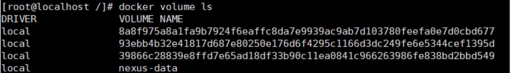
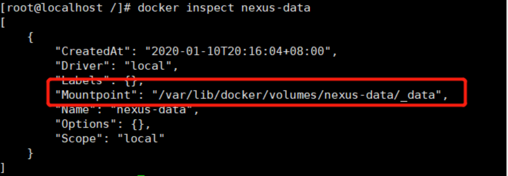

#### docker volume 持久化数据

1. ##### 创建 volume 方式一

    ```
    $ docker volume create --name nexus-data
    ```

2. ##### 创建volume 方式二

    ```
    $ docker run .... -v /nexus-data:/nexus-data
    ```

3. ##### 查看创建的volume 

    ```
    $ docker volume ls
    ```

    

4. ##### 查看 volume 详细信息

    ```
    $ docker inspect nexus-data
    ```

    

5. ##### 删除 volume

   ```
   $ docker volume rm nexus-data
   ```

   

